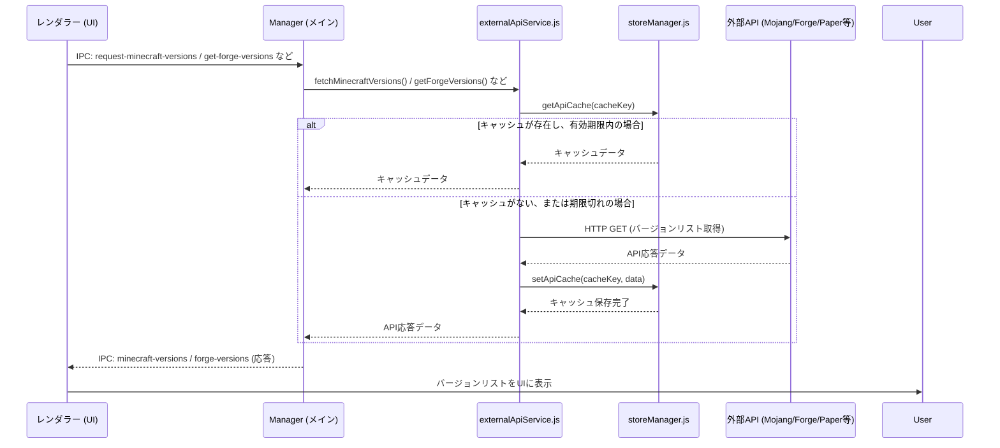
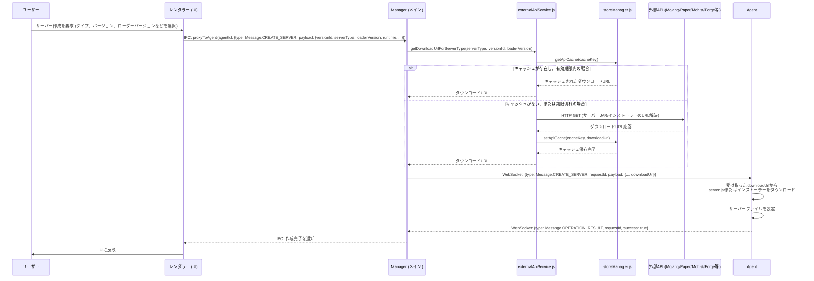
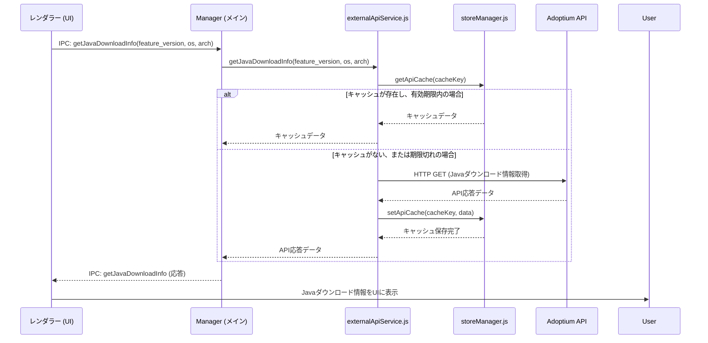
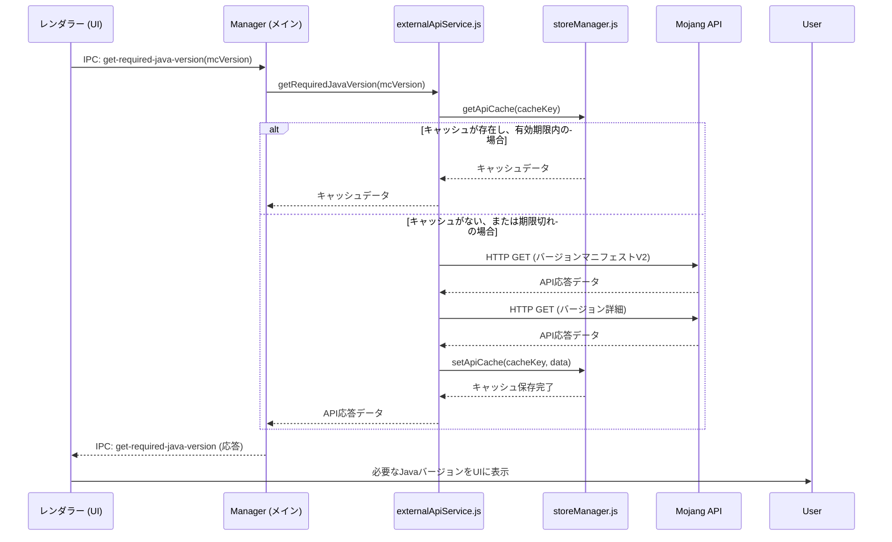

# API戦略とキャッシュメカニズム

このドキュメントは、NL-ServerManagerにおける外部APIとの連携戦略、特にManagerへのAPI呼び出し集約とキャッシュメカニズムについて詳述します。

## 1. 基本方針: ManagerへのAPI呼び出し集約

以前の設計では、一部のAPI呼び出し（特にサーバーJARのダウンロードURL取得）が`Agent`側で行われていました。しかし、今回のリファクタリングにより、**全ての外部APIアクセスは`Manager`の`externalApiService.js`に集約**されました。

### メリット

*   **一元化されたAPI管理:** 外部APIとの通信ロジックが`Manager`の`externalApiService.js`に集約されるため、保守性が向上します。
*   **効率的なキャッシュ利用:** 全てのAPI応答を`Manager`側で一元的にキャッシュできるようになり、外部APIへのリクエスト数を削減し、パフォーマンスを向上させます。
*   **Agentの軽量化:** `Agent`はAPI呼び出しロジックを持つ必要がなくなり、より軽量でシンプルな責務に集中できます。
*   **セキュリティ向上:** 外部APIキーなどの機密情報が`Manager`側で一元管理され、`Agent`が直接外部と通信するリスクが減少します。

### 影響範囲

*   **`Manager/src/services/externalApiService.js`:** 全ての外部APIリクエストを担当し、キャッシュ機構を内包します。
*   **`Manager/src/ipc/mainHandlers.js`:** サーバー作成要求を受け取った際に`externalApiService`を呼び出し、ダウンロードURLを取得して`Agent`に渡します。
*   **`Agent/src/services/serverConfigService.js`:** API呼び出しロジックを削除し、`Manager`から渡された`downloadUrl`を使用してダウンロードを実行します。
*   **プロトコル (`common/protocol.js`):** `CREATE_SERVER`メッセージのペイロードに`downloadUrl`を追加しました。

## 2. APIキャッシュの仕様

API呼び出しのパフォーマンス向上と外部サービスへの負荷軽減のため、`Manager`は`electron-store`を利用したキャッシュメカニズムを導入しています。

### 2.1. キャッシュの保存場所とデータ構造

キャッシュは`electron-store`を通じて、OS標準のユーザーデータディレクトリに保存される`config.json`ファイル内の`apiCache`キー配下に格納されます。

**`config.json`内の`apiCache`構造の例:**

```json
{
  "apiCache": {
    "javaVersion-1.20.4": {
      "timestamp": 1700000000000, // キャッシュが保存されたUnixタイムスタンプ
      "data": 17 // キャッシュされたデータ（例: Javaのメジャーバージョン）
    },
    "javaDownloadInfo-17-linux-x64": {
      "timestamp": 1700000000000,
      "data": {
        "success": true,
        "downloadLink": "https://api.adoptium.net/.../OpenJDK17U-jdk_x64_linux_hotspot_17...",
        "fileSize": 123456789
      }
    },
    "minecraftVersions": {
      "timestamp": 1700000000000,
      "data": [ /* Mojang APIのバージョンマニフェストデータ */ ]
    },
    "forgeVersions": {
      "timestamp": 1700000000000,
      "data": {
        "success": true,
        "promotions": { /* Forge promotions_slim.jsonデータ */ }
      }
    },
    "mohistVersions": {
      "timestamp": 1700000000000,
      "data": [ { "name": "1.20.1" }, { "name": "1.16.5" } ]
    },
    "mohistBuilds-1.12.2": {
      "timestamp": 1700000000000,
      "data": [ { "id": 220, "build_date": "2025-07-21T06:02:03Z", ... } ]
    },
    // ...その他のAPIキャッシュ
    "downloadUrl-vanilla-1.20.4-": { // downloadUrlはloaderVersionがない場合ハイフンで終わる
      "timestamp": 1700000000000,
      "data": "https://piston-data.mojang.com/v1/objects/.../server.jar"
    },
    "downloadUrl-forge-1.20.1-47.2.0": {
      "timestamp": 1700000000000,
      "data": "https://maven.minecraftforge.net/.../forge-...-installer.jar"
    },
    "downloadUrl-mohist-1.12.2-220": {
      "timestamp": 1700000000000,
      "data": "https://api.mohistmc.com/project/mohist/1.12.2/builds/220/download"
    }
  }
}
```

### 2.2. キャッシュキーの生成ルール

キャッシュキーは、APIの種類とリクエストパラメータに基づいて一意に生成されます。

*   **Javaバージョン (`getRequiredJavaVersion`):** `javaVersion-{mcVersion}` または `javaVersion-{mcVersion}-{serverType}` (Mohistの場合など)
*   **Javaダウンロード情報 (`getJavaDownloadInfo`):** `javaDownloadInfo-{feature_version}-{os}-{arch}`
*   **Minecraftバージョンリスト (`fetchMinecraftVersions`):** `minecraftVersions` (固定)
*   **Forgeバージョンリスト (`getForgeVersions`):** `forgeVersions` (固定)
*   **Fabricバージョンリスト (`getFabricVersions`):** `fabricVersions` (固定)
*   **Quiltバージョンリスト (`getQuiltVersions`):** `quiltVersions` (固定)
*   **NeoForgeバージョンリスト (`getNeoForgeVersions`):** `neoForgeVersions-{mcVersion}`
*   **Paperバージョンリスト (`getPaperVersions`):** `paperVersions_v3` (固定)
*   **Paperビルドリスト (`getPaperBuilds`):** `paperVersions_v3` のキャッシュから取得 (独立したキーなし)
*   **Mohistバージョンリスト (`getMohistVersions`):** `mohistVersions` (固定)
*   **Mohistビルドリスト (`getMohistBuilds`):** `mohistBuilds-{mcVersion}`
*   **サーバーJAR/インストーラーダウンロードURL (`getDownloadUrlForServerType`):** `downloadUrl-{serverType}-{versionId}-{loaderVersion || ''}`

### 2.3. キャッシュの有効期限

*   キャッシュの有効期限は `manager/src/services/externalApiService.js` 内で `CACHE_EXPIRATION_HOURS = 24` と定義されており、**24時間**です。
*   この時間を過ぎたキャッシュエントリは「期限切れ」と判断され、再度外部APIへのリクエストが行われます。

## 3. 具体的な操作とAPI呼び出し/データフロー

### 3.1. ユーザーが利用可能なMinecraftバージョンリストを表示する

#### シーケンス図



#### 詳細

*   **操作:** ユーザーが「新規サーバー作成」ボタンをクリックし、作成モーダルを開く。
*   **API呼び出し:** モーダル表示時に、以下のAPIが**並列で**一括して呼び出され、結果がキャッシュされます。
    *   `fetchMinecraftVersions()`: Mojangのバージョンマニフェスト (`https://launchermeta.mojang.com/mc/game/version_manifest.json`)
    *   `getForgeVersions()`: Forgeのプロモーション情報 (`https://files.minecraftforge.net/maven/net/minecraftforge/forge/promotions_slim.json`)
    *   `getFabricVersions()`: Fabricのローダーバージョン (`https://meta.fabricmc.net/v2/versions/loader`)
    *   `getQuiltVersions()`: Quiltのローダーバージョン (`https://meta.quiltmc.org/v3/versions/loader`)
    *   `getPaperVersions()`: Paperのバージョンとビルド情報 (`https://fill.papermc.io/v3/projects/paper/versions`)
    *   `getMohistVersions()`: Mohistのプロジェクト情報 (`https://api.mohistmc.com/project/mohist/versions`)
*   **データ:** 各APIから取得したバージョンリストデータ。
*   **キャッシュの利用:** ユーザーがモーダル内でサーバータイプを切り替える際には、これらのキャッシュされたデータが即座に使用され、UIが同期的に更新されます。バージョン選択に応じて、以下のAPIが追加で呼び出されることがあります。
    *   `getNeoForgeVersions(mcVersion)`: NeoForgeのmaven-metadata (`https://maven.neoforged.net/.../maven-metadata.xml`)
    *   `getMohistBuilds(mcVersion)`: Mohistのビルド情報 (`https://api.mohistmc.com/project/mohist/{mcVersion}/builds`)
    *   `getPaperBuilds(mcVersion)`: `getPaperVersions`でキャッシュしたデータからビルド情報を抽出します。

### 3.2. 新規Minecraftサーバーを作成する

#### シーケンス図



#### 詳細

*   **操作:** ユーザーがサーバー作成ダイアログで必要な情報を入力し、「作成」ボタンをクリックする。
*   **API呼び出し:**
    *   `getDownloadUrlForServerType(serverType, versionId, loaderVersion)`:
        *   Vanilla: Mojangのバージョンマニフェストとバージョン詳細 (`https://launchermeta.mojang.com/mc/game/version_manifest.json` と `versionInfo.url`)
        *   Forge/NeoForge: MavenリポジトリのインストーラーJARの直接URL
        *   Fabric/Quilt: Fabric/QuiltインストーラーJARの直接URL
        *   Paper: PaperMC API (`https://api.papermc.io/v2/projects/paper/versions/{versionId}/builds/{buildId}/downloads/paper-{versionId}-{buildId}.jar`) の形式でダウンロードURLを直接構築します。
        *   Mohist: MohistMC API (`https://api.mohistmc.com/project/mohist/{mcVersion}/builds/{buildId}/download`) から特定のビルドのダウンロードURLを取得します。`loaderVersion`として`'latest'`が渡された場合、`getMohistBuilds`を内部で呼び出して最新のビルドIDを解決します。
*   **データ:** 解決されたサーバーJARまたはインストーラーの直接ダウンロードURL。
*   **キャッシュの利用:** `getDownloadUrlForServerType`関数内で、`downloadUrl-{serverType}-{versionId}-{loaderVersion}`の形式でキャッシュが利用されます。

### 3.3. Javaのダウンロード情報を取得する

#### シーケンス図



#### 詳細

*   **操作:** ユーザーがJavaのダウンロードを検討する際など、Javaのダウンロード情報を必要とする場合。
*   **API呼び出し:** `getJavaDownloadInfo(feature_version, os, arch)`: Adoptium API (`https://api.adoptium.net/v3/assets/latest/...`)
*   **データ:** Javaのダウンロードリンク、ファイルサイズなど。
*   **キャッシュの利用:** `javaDownloadInfo-{feature_version}-{os}-{arch}`の形式でキャッシュが利用されます。

### 3.4. Minecraftバージョンに必要なJavaバージョンを取得する

#### シーケンス図



#### 詳細

*   **操作:** 特定のMinecraftバージョンに必要なJavaバージョンを知りたい場合。
*   **API呼び出し:** `getRequiredJavaVersion(mcVersion, serverType)`: MojangのバージョンマニフェストV2 (`https://piston-meta.mojang.com/mc/game/version_manifest_v2.json`) と、そこから得られるバージョン詳細URLへのアクセス。
*   **特殊ロジック:** `serverType`が `'mohist'` で、Mojangが要求するJavaバージョンが `8` の場合、戻り値は `11` に上書きされます。
*   **データ:** 必要なJavaのメジャーバージョン。
*   **キャッシュの利用:** `javaVersion-{mcVersion}` または `javaVersion-{mcVersion}-{serverType}` の形式でキャッシュが利用されます。