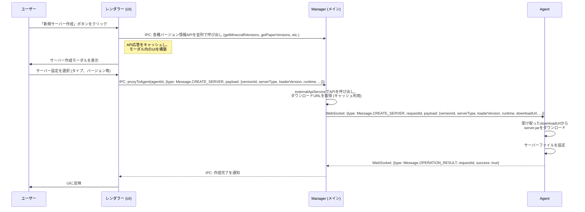
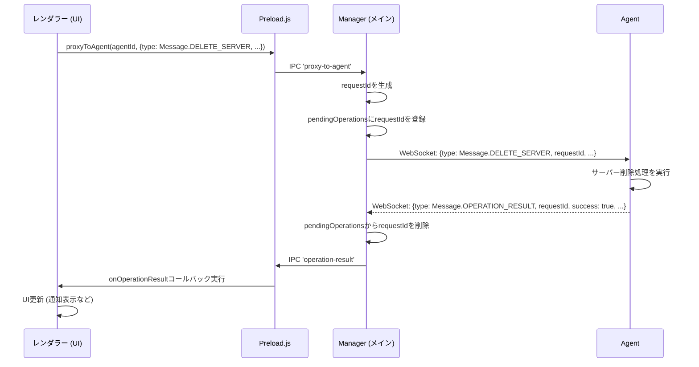
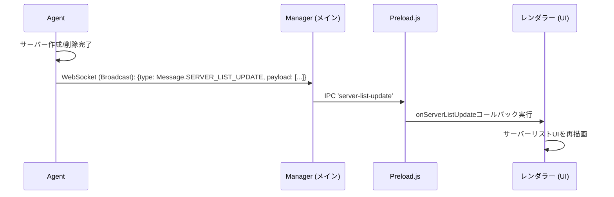
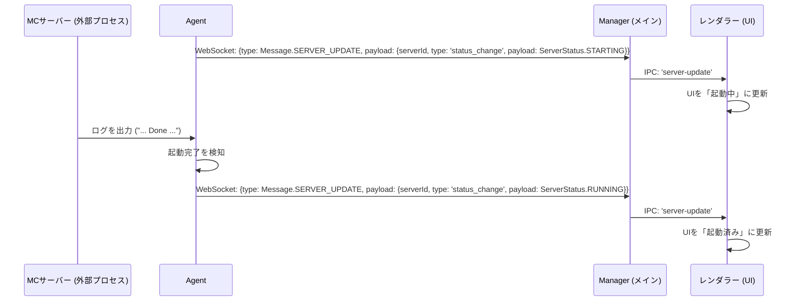
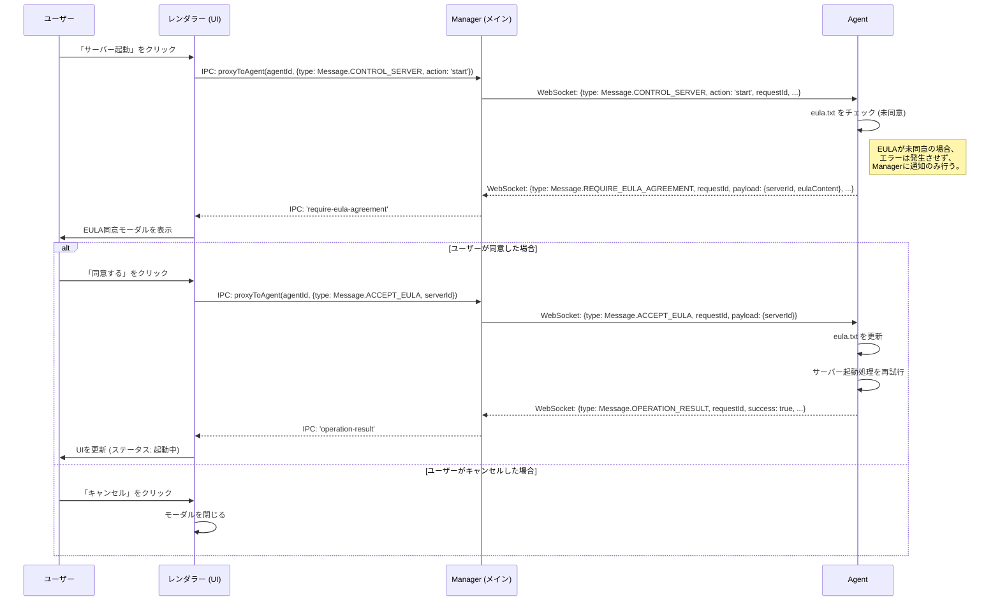
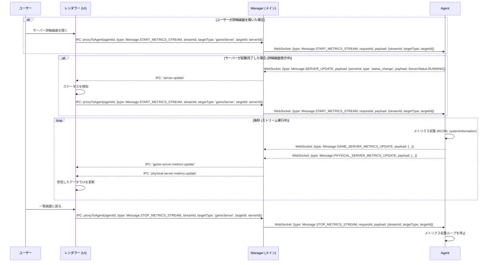
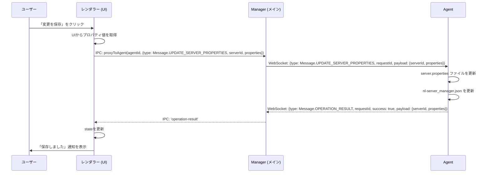
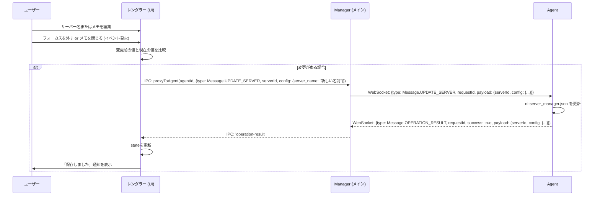
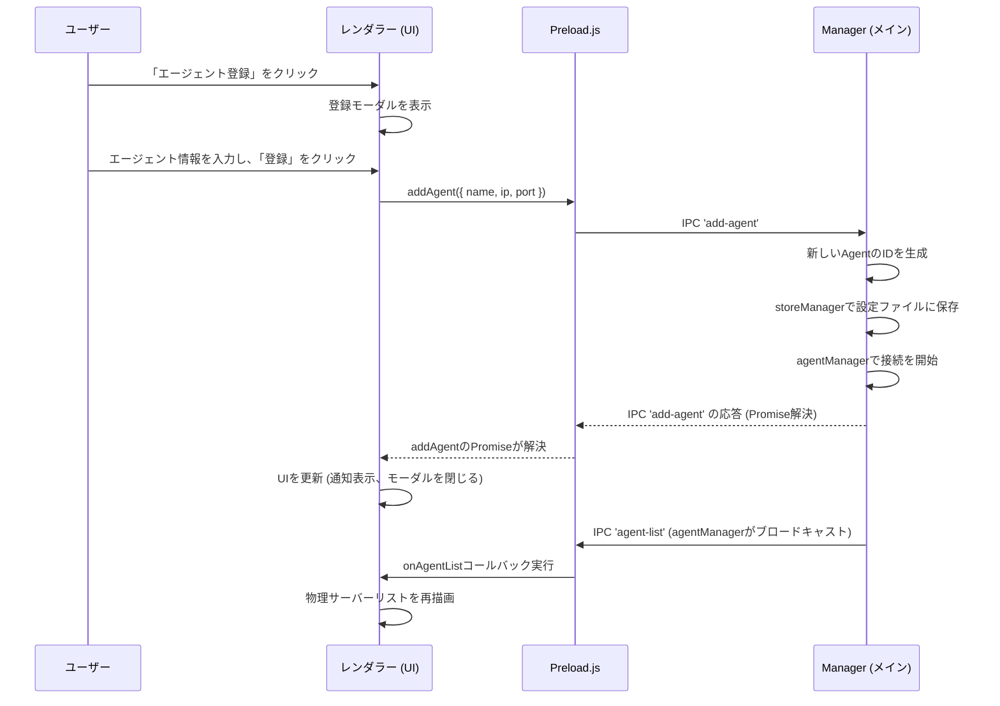
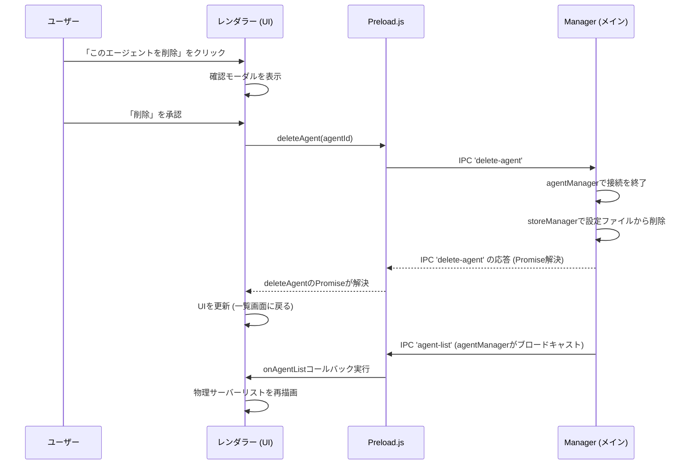

# NL-ServerManager 通信フロー解説

このドキュメントは、NL-ServerManagerの`Manager` (Electron GUI) と `Agent` (Node.jsプロセス) 間の通信アーキテクチャとデータフローを包括的に解説します。すべてのメッセージタイプは[`@nl-server-manager/common/protocol.js`](common/protocol.js:1)で定義された`Message`オブジェクト定数を使用します。

## 1. 通信の概要

本システムは、2つの主要な通信チャネルを利用しています。

-   **IPC (プロセス間通信)**: `Manager`の**メインプロセス**と**レンダラープロセス**（UI）間の通信です。セキュリティ上の理由から、UIからの操作要求やメインプロセスからのUI更新通知はすべてこのチャネルを経由します。
-   **WebSocket**: `Manager`の**メインプロセス**と、各`Agent`プロセス間の通信です。実際のサーバー操作コマンドの送信や、`Agent`からの結果・状態通知に使用されます。

## 2. メッセージの基本構造と非同期処理

`Manager`と`Agent`間のWebSocketメッセージは、すべて[`@nl-server-manager/common/protocol.js`](common/protocol.js:1)で定義された規約に従います。

-   **要求ID (`requestId`):** `Manager`から`Agent`へのすべての要求には、一意の`requestId`が付与されます。
-   **応答 (`Message.OPERATION_RESULT`):** `Agent`は、処理が完了した際に必ず同じ`requestId`を含む`Message.OPERATION_RESULT`メッセージを返します。これにより、`Manager`はどの要求に対する応答かを正確に対応付けることができます。
-   **進捗 (`Message.PROGRESS_UPDATE`):** 時間のかかる処理（サーバー作成、Javaインストールなど）の途中経過は、`Message.PROGRESS_UPDATE`メッセージで通知されます。

## 3. 主要な通信フロー

### フロー1: ManagerからAgentへのサーバー作成要求 (ダウンロードURL解決を含む)

ユーザーがUIでサーバー作成を要求した際の通信フローです。Managerが外部APIからダウンロードURLを解決し、Agentに伝達します。

1.  **UI → Main (IPC) / バージョン情報の事前取得:** ユーザーが「新規サーバー作成」ボタンをクリックすると、レンダラープロセスはサーバー作成モーダルを開く前に、サポートされている全サーバータイプ（Vanilla, Paper, Mohistなど）のバージョン情報を取得するためのAPI呼び出しを並列でメインプロセスに要求します。
2.  **UIの構築と表示:** メインプロセスは外部APIから取得した情報をレンダラープロセスに返し、レンダラープロセスはこれをキャッシュします。その後、キャッシュされたデータを用いてバージョン選択ドロップダウンなどを構築し、ユーザーにモーダルを表示します。ユーザーがモーダル内でサーバータイプを切り替えると、API通信は発生せず、キャッシュからUIが即座に更新されます。
3.  **UI → Main (IPC) / サーバー作成要求:** ユーザーが必要な設定を選択し「作成」ボタンをクリックすると、レンダラープロセスは[`preload.js`](manager/preload.js:1)を介して`proxy-to-agent`チャネルに`Message.CREATE_SERVER`メッセージを送信します。
4.  **MainプロセスでのダウンロードURL解決:** メインプロセスは、`externalApiService.js`を呼び出して、指定されたサーバータイプとバージョンに対応するサーバーJARまたはインストーラーのダウンロードURLを外部APIから取得します。この際、`externalApiService`はキャッシュを利用してAPI呼び出しを最適化します。
5.  **Main → Agent (WebSocket):** メインプロセスは、取得した`downloadUrl`を`Message.CREATE_SERVER`メッセージの`payload`に含め、`requestId`を付与して対象の`Agent`にWebSocketで送信します。
6.  **Agentでのダウンロードと設定:** `Agent`は`downloadUrl`を受け取り、そのURLからサーバーJARまたはインストーラーをダウンロードし、適切な場所に配置します。
7.  **Agent → Main (WebSocket):** `Agent`はサーバー作成処理が完了した後、`requestId`を含む`Message.OPERATION_RESULT`メッセージを返します。
8.  **Main → UI (IPC):** メインプロセスは結果を`operation-result`チャネルでUIに通知し、UIは作成完了をユーザーに表示します。
2.  **MainプロセスでのダウンロードURL解決:** メインプロセスは、`externalApiService.js`を呼び出して、指定されたサーバータイプとバージョンに対応するサーバーJARまたはインストーラーのダウンロードURLを外部APIから取得します。この際、`externalApiService`はキャッシュを利用してAPI呼び出しを最適化します。
3.  **Main → Agent (WebSocket):** メインプロセスは、取得した`downloadUrl`を`Message.CREATE_SERVER`メッセージの`payload`に含め、`requestId`を付与して対象の`Agent`にWebSocketで送信します。
4.  **Agentでのダウンロードと設定:** `Agent`は`downloadUrl`を受け取り、そのURLからサーバーJARまたはインストーラーをダウンロードし、適切な場所に配置します。
5.  **Agent → Main (WebSocket):** `Agent`はサーバー作成処理が完了した後、`requestId`を含む`Message.OPERATION_RESULT`メッセージを返します。
6.  **Main → UI (IPC):** メインプロセスは結果を`operation-result`チャネルでUIに通知し、UIは作成完了をユーザーに表示します。

### フロー2: ManagerからAgentへの操作要求 (例: サーバー削除)

ユーザーがUIでサーバー削除ボタンをクリックした際の通信フローです。

1.  **UI → Main (IPC):** レンダラープロセスは、[`preload.js`](manager/preload.js:1)を介して`proxy-to-agent`チャネルにIPCメッセージを送信します。
2.  **Main → Agent (WebSocket):** メインプロセスは、メッセージに`requestId`を付与し、対象の`Agent`にWebSocketで送信します。この`requestId`は完了応答を待つために`pendingOperations`マップに保存されます。
3.  **Agent → Main (WebSocket):** `Agent`は処理完了後、`requestId`を含む`Message.OPERATION_RESULT`メッセージを返します。
4.  **Main → UI (IPC):** メインプロセスは結果を`operation-result`チャネルでUIに通知します。

### フロー3: AgentからManagerへの自発的な状態更新 (ブロードキャスト)

`Agent`側でのサーバー作成や削除が完了し、全Managerのサーバーリストを更新する必要がある場合のフローです。

1.  **Agent → Main (WebSocket):** `Agent`は、接続している**すべての**`Manager`クライアントに対し、`Message.SERVER_LIST_UPDATE`メッセージをブロードキャストします。これには`requestId`は含まれません。
2.  **Main → UI (IPC):** メインプロセスは受信したリストを`server-list-update`チャネルでUIに転送します。
3.  **UI更新:** レンダラーは新しいサーバーリストを元に画面を再描画します。

### フロー3: Agent内部イベントの通知 (例: サーバーログ)

実行中のサーバープロセスが新しいログを出力した場合など、Agent内部で発生したイベントを通知するフローです。

1.  **起動開始通知:** `startServer`関数が呼ばれると、`Agent`は即座にステータスが`ServerStatus.STARTING`になったことを`Manager`に通知します。UIはこれを受けて「起動中」の表示に切り替わります。
2.  **ログ監視と完了検知:** `Agent`はサーバープロセスの標準出力を監視し、起動完了を示す特定のログ（例: "Done"）を待ち受けます。
3.  **起動完了通知:** 完了を示すログを検知すると、`Agent`はステータスが`ServerStatus.RUNNING`になったことを`Manager`に通知します。UIはこれを受けて「起動済み」の表示に更新します。

### フロー4: EULA同意フロー

サーバー初回起動時など、`eula.txt`への同意が必要な場合のインタラクティブなフローです。

1.  **起動要求:** 通常のサーバー起動フローと同様に、`Manager`から`Agent`へ`Message.CONTROL_SERVER`メッセージが送信されます。
2.  **EULAチェック:** `Agent`内の`startServer`関数が、サーバープロセスを起動する前に`eula.txt`をチェックします。
3.  **同意要求 (Agent → Manager):** EULAが未同意の場合、`Agent`はサーバーを起動しません。この状態はエラーとして扱われず、代わりに`Message.REQUIRE_EULA_AGREEMENT`メッセージを`Manager`に返します。`payload`には`eula.txt`の現在の内容が含まれます。
4.  **モーダル表示:** `Manager`のUIは、このメッセージを受けてEULA同意モーダルをユーザーに提示します。
5.  **同意/拒否 (Manager → Agent):** ユーザーが「同意する」をクリックすると、`Manager`は`Message.ACCEPT_EULA`メッセージを`Agent`に送信します。
6.  **EULA更新と再起動:** `Agent`は`eula.txt`を`eula=true`に更新し、再度`startServer`処理を試行します。成功すれば、通常の`Message.OPERATION_RESULT`を返してフローを完了します。

### フロー5: メトリクスストリーミング (リアルタイム更新)

サーバー詳細画面などで、CPU使用率やプレイヤー数などのメトリクスをリアルタイムに更新するためのフローです。

1.  **ストリーム開始要求:** メトリクスストリーミングは、以下のいずれかのタイミングで開始されます。
    -   ユーザーがサーバー詳細画面を開いたとき。
    -   ユーザーがサーバー詳細画面を閲覧中に、対象サーバーのステータスが「起動完了 (`ServerStatus.RUNNING`)」に変化したとき。
    いずれの場合も、`Manager`は`Message.START_METRICS_STREAM`メッセージを`Agent`に送信します。
2.  **メトリクス収集と送信:** `Agent`は、この要求を受け取ると、1秒ごとにメトリクス（TPS、プレイヤー数、CPU/RAM使用率など）を収集し、`Message.GAME_SERVER_METRICS_UPDATE`または`Message.PHYSICAL_SERVER_METRICS_UPDATE`メッセージで`Manager`に送信し続けます。
3.  **UIのリアルタイム更新:** `Manager`は受信したメトリクスデータを使って、UIの状態をリアルタイムで更新します。
4.  **ストリーム停止要求:** ユーザーが詳細画面を閉じると、`Manager`は`Message.STOP_METRICS_STREAM`メッセージを`Agent`に送信し、`Agent`はメトリクスの収集と送信を停止します。

### フロー6: サーバープロパティの更新

ユーザーがサーバープロパティを変更し、「変更を保存」ボタンをクリックした際のフローです。

1.  **UI → Main (IPC):** ユーザーが保存ボタンをクリックすると、レンダラーはUI上のすべてのプロパティ入力から値を取得し、`proxyToAgent` IPCチャネルを通じて`Message.UPDATE_SERVER_PROPERTIES`メッセージをメインプロセスに中継を依頼します。
2.  **Main → Agent (WebSocket):** メインプロセスは要求に `requestId` を付与し、`Agent` に `Message.UPDATE_SERVER_PROPERTIES` メッセージを送信します。
3.  **Agentでの処理:** `Agent` は受信したプロパティで `server.properties` ファイルと `nl-server_manager.json` の両方をアトミックに更新します。
4.  **Agent → Main → UI (レスポンス):** `Agent` は処理結果を `Message.OPERATION_RESULT` で返します。成功した場合、UIは状態を更新し、ユーザーに成功通知を表示します。

### フロー7: サーバー設定の更新（名前、メモ）

ユーザーがUI上でサーバー名やメモをインラインで編集した際のフローです。`focusout`やメモ編集エリアを閉じるなどのイベントをトリガーとします。

1.  **ユーザー操作:** ユーザーがサーバー名やメモを編集し、フォーカスを外すなどの保存トリガーとなる操作を行います。
2.  **変更検知:** `renderer.js` はイベントを検知し、メモリ上の`state`と現在のUIの値を比較して、実際の内容変更があったかを確認します。
3.  **UI → Main → Agent (リクエスト):** 変更があった場合のみ、レンダラーは `proxyToAgent` を通じて `Message.UPDATE_SERVER` メッセージの送信を要求します。`payload`の`config`オブジェクトには、`{ server_name: "新しい名前" }` や `{ memo: "新しいメモ" }` のように、変更があったフィールドのみが含まれます。
4.  **Agentでの処理:** `Agent` は受信した`config`オブジェクトを既存の設定にマージし、`nl-server_manager.json` ファイルを更新して変更を永続化します。
5.  **Agent → Main → UI (レスポンス):** `Agent` は処理結果（更新後の`config`を含む）を `Message.OPERATION_RESULT` で返します。UIはこれを受けて`state`を最新の状態に保ち、ユーザーに成功通知を表示します。

### フロー8: エージェントの登録

ユーザーがUIから新しいエージェントを登録する際のフローです。このフローはAgentとの通信を伴わず、Manager内部で完結します。

1.  **UI → Main (IPC):** レンダラープロセスは、ユーザーが入力した設定情報（エイリアス、IP、ポート）を[`preload.js`](manager/preload.js:1)経由で`add-agent`チャネルに送信します。
2.  **Mainプロセスでの処理:**
    *   `mainHandlers.js` はリクエストを受け取ります。
    *   `uuidv4`で新しいAgentの一意なIDを生成します。
    *   `storeManager.js` を呼び出し、新しいAgent情報を`config.json`に永続化します。
    *   `agentManager.js` を呼び出し、新しいAgentへのWebSocket接続シーケンスを開始します。
3.  **Main → UI (IPC):** `agentManager`はAgentリストの変更を検知し、`agent-list`チャネルを通じて更新されたリストをUIにブロードキャストします。
4.  **UI更新:** レンダラーは新しいリストを受け取り、物理サーバー一覧画面を再描画します。

### フロー9: エージェントの削除

ユーザーがUIから既存のエージェントを削除する際のフローです。

1.  **UI → Main (IPC):** レンダラープロセスは、削除対象の`agentId`を[`preload.js`](manager/preload.js:1)経由で`delete-agent`チャネルに送信します。
2.  **Mainプロセスでの処理:**
    *   `mainHandlers.js` はリクエストを受け取ります。
    *   `agentManager.js` を呼び出し、対象AgentのWebSocket接続を終了させ、管理マップから削除します。
    *   `storeManager.js` を呼び出し、`config.json`から対象Agentの情報を削除して永続化します。
3.  **Main → UI (IPC):** `agentManager`はAgentリストの変更を検知し、`agent-list`チャネルを通じて更新されたリストをUIにブロードキャストします。
4.  **UI更新:** レンダラーは新しいリストを受け取り、物理サーバー一覧画面を再描画します。