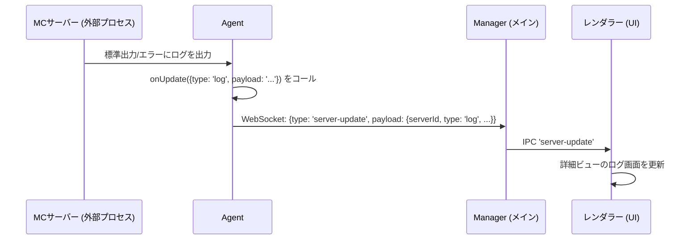

# NL-ServerManager 通信フロー解説

このドキュメントは、NL-ServerManagerの`Manager` (Electron GUI) と `Agent` (Node.jsプロセス) 間の通信アーキテクチャとデータフローを包括的に解説します。

## 1. 通信の概要

本システムは、2つの主要な通信チャネルを利用しています。

-   **IPC (プロセス間通信)**: `Manager`の**メインプロセス**と**レンダラープロセス**（UI）間の通信です。セキュリティ上の理由から、UIからの操作要求やメインプロセスからのUI更新通知はすべてこのチャネルを経由します。
-   **WebSocket**: `Manager`の**メインプロセス**と、各`Agent`プロセス間の通信です。実際のサーバー操作コマンドの送信や、`Agent`からの結果・状態通知に使用されます。

## 2. メッセージの基本構造と非同期処理

`Manager`と`Agent`間のWebSocketメッセージは、すべて`common/protocol.js`で定義された規約に従います。

-   **要求ID (`requestId`):** `Manager`から`Agent`へのすべての要求には、一意の`requestId`が付与されます。
-   **応答 (`OPERATION_RESULT`):** `Agent`は、処理が完了した際に必ず同じ`requestId`を含む`OPERATION_RESULT`メッセージを返します。これにより、`Manager`はどの要求に対する応答かを正確に対応付けることができます。
-   **進捗 (`PROGRESS_UPDATE`):** 時間のかかる処理（サーバー作成、Javaインストールなど）の途中経過は、`PROGRESS_UPDATE`メッセージで通知されます。

## 3. 主要な通信フロー

### フロー1: ManagerからAgentへの操作要求 (例: サーバー削除)

ユーザーがUIでサーバー削除ボタンをクリックした際の通信フローです。

1.  **UI → Main (IPC):** レンダラープロセスは、[`preload.js`](manager/preload.js:10)を介して`proxy-to-agent`チャネルにIPCメッセージを送信します。
2.  **Main → Agent (WebSocket):** メインプロセスは、メッセージに`requestId`を付与し、対象の`Agent`にWebSocketで送信します。この`requestId`は完了応答を待つために`pendingOperations`マップに保存されます。
3.  **Agent → Main (WebSocket):** `Agent`は処理完了後、`requestId`を含む`OPERATION_RESULT`メッセージを返します。
4.  **Main → UI (IPC):** メインプロセスは結果を`operation-result`チャネルでUIに通知します。

### フロー2: AgentからManagerへの自発的な状態更新 (ブロードキャスト)

`Agent`側でのサーバー作成や削除が完了し、全Managerのサーバーリストを更新する必要がある場合のフローです。

1.  **Agent → Main (WebSocket):** `Agent`は、接続している**すべての**`Manager`クライアントに対し、`server_list_update`メッセージをブロードキャストします。これには`requestId`は含まれません。
2.  **Main → UI (IPC):** メインプロセスは受信したリストを`server-list-update`チャネルでUIに転送します。
3.  **UI更新:** レンダラーは新しいサーバーリストを元に画面を再描画します。

### フロー3: Agent内部イベントの通知 (例: サーバーログ)

実行中のサーバープロセスが新しいログを出力した場合など、Agent内部で発生したイベントを通知するフローです。

1.  **Agent内部:** `startServer`時に起動されたサーバープロセスからの出力を監視します。
2.  **Agent → Main (WebSocket):** 新しいログを受け取ると、`Agent`は`server-update`メッセージを`Manager`に送信します。これには、どのサーバーの更新かを示す`serverId`が含まれます。
3.  **Main → UI (IPC):** メインプロセスは受信した更新情報を`server-update`チャネルでUIに転送します。
4.  **UI更新:** UIは、現在表示中の詳細画面が対象のサーバーであれば、ログ表示を更新します。

### フロー4: EULA同意フロー

サーバー初回起動時など、`eula.txt`への同意が必要な場合のインタラクティブなフローです。

1.  **起動要求:** 通常のサーバー起動フローと同様に、`Manager`から`Agent`へ`CONTROL_SERVER`メッセージが送信されます。
2.  **EULAチェック:** `Agent`内の`startServer`関数が、サーバープロセスを起動する前に`eula.txt`をチェックします。
3.  **同意要求 (Agent → Manager):** EULAが未同意の場合、`Agent`はサーバーを起動せず、代わりに`REQUIRE_EULA_AGREEMENT`メッセージを`Manager`に返します。`payload`には`eula.txt`の現在の内容が含まれます。
4.  **モーダル表示:** `Manager`のUIは、このメッセージを受けてEULA同意モーダルをユーザーに提示します。
5.  **同意/拒否 (Manager → Agent):** ユーザーが「同意する」をクリックすると、`Manager`は`ACCEPT_EULA`メッセージを`Agent`に送信します。
6.  **EULA更新と再起動:** `Agent`は`eula.txt`を`eula=true`に更新し、再度`startServer`処理を試行します。成功すれば、通常の`OPERATION_RESULT`を返してフローを完了します。